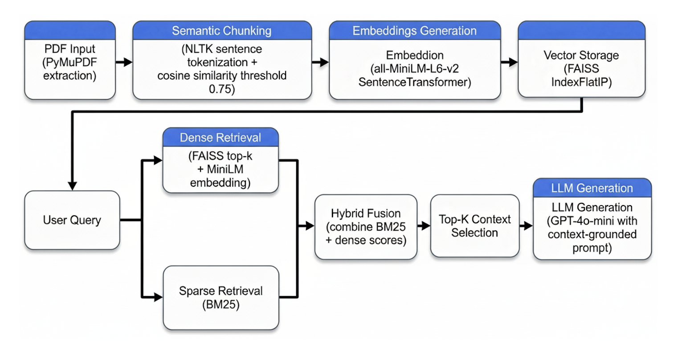

# Retrieval-Augmented Generation (RAG) System with Hybrid Search & LLM Evaluation

A production-style RAG pipeline that combines FAISS (semantic search), BM25 (lexical search), Reciprocal Rank Fusion (RRF), and LLM-based evaluation to answer questions from financial documents.

## Problem Statement

Large documents such as financial reports are difficult to query accurately using LLMs alone due to context limits and hallucinations. This project demonstrates how Retrieval-Augmented Generation (RAG) can be used to retrieve relevant context before generating answers, improving accuracy and faithfulness.

## Key Features

- Semantic retrieval using FAISS and sentence-transformer embeddings
- Lexical retrieval using BM25
- Hybrid ranking via Reciprocal Rank Fusion (RRF)
- Context-grounded answer generation using OpenAI LLMs
- LLM-based evaluation (faithfulness & answer relevance)
- Modular, production-oriented architecture

## Architecture

## Tech Stack

- Python 3.11
- FAISS (vector similarity search)
- Sentence Transformers (all-MiniLM-L6-v2)
- BM25 (rank-bm25)
- OpenAI API
- Hugging Face Tokenizers
- NumPy

## How It Works

- Documents are loaded and chunked into semantically meaningful sections
- Each chunk is embedded and indexed in FAISS
- At query time, both semantic (FAISS) and lexical (BM25) retrieval are performed
- Results are merged using Reciprocal Rank Fusion
- The top-ranked chunks are passed to the LLM as context
- Answers are evaluated using an LLM judge for faithfulness and relevance

## Evaluation

The system is evaluated using a curated question–answer dataset derived from the source document.

Metrics:
- Faithfulness: Is the answer grounded in the retrieved context?
- Answer Relevance: Does the answer address the question?

Evaluation is performed using an LLM-based judge with structured JSON output.
